# Grain Garden
Grain Garden is a granular synthesizer controlled by a procedurally generated plant.
Built with Rust, Egui and Rodio.

## Sequencer
Currently, the sequencer is in its most basic form, where a leaf from the tree is randomly selected, and this corresponds with a grain.
The height, relative to the max height of the tree is the grain start position inside the spawning window.
The x position corresponds with panning the grain. The granular control module has a density parameter, specifying grain spawn rate in Hz.

## Screenshots
The Ui for Grain Garden currently looks like this.
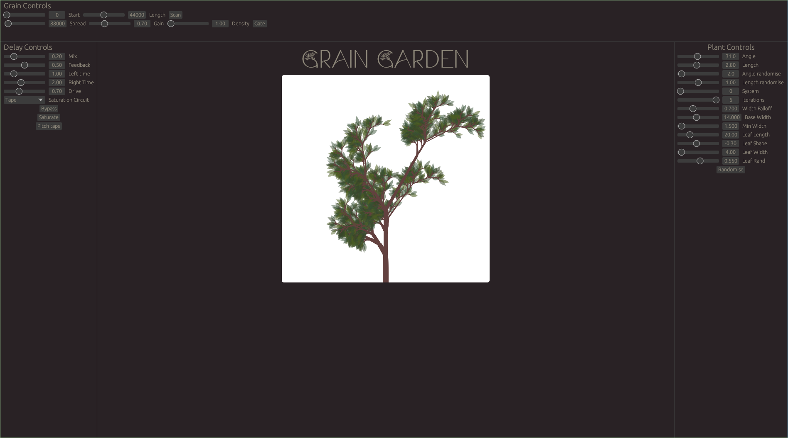

### Some examples of procedural plants

    
Ferns

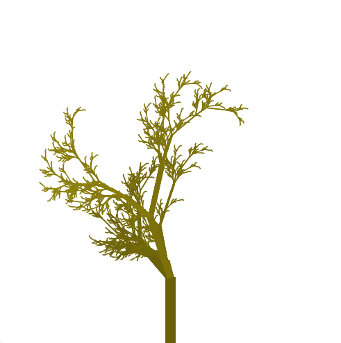
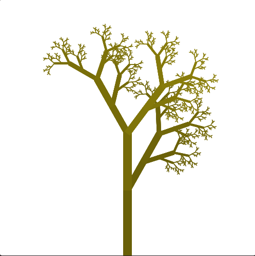
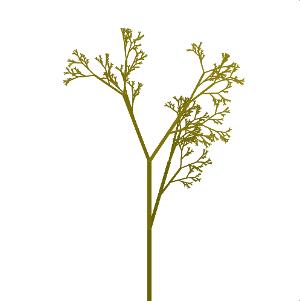
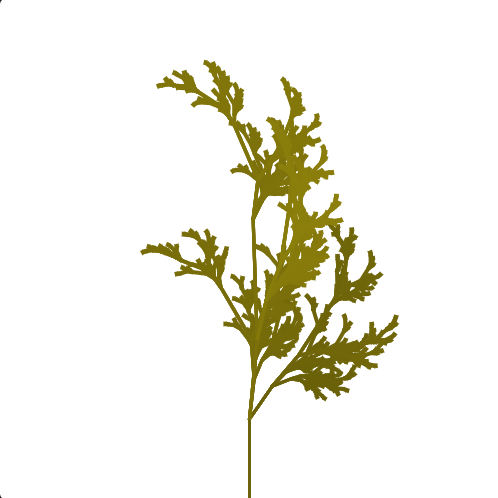

    
Trees

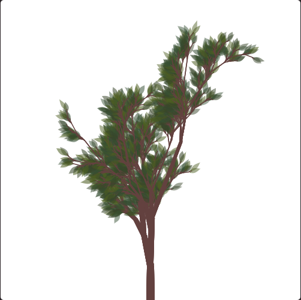
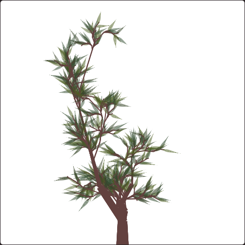
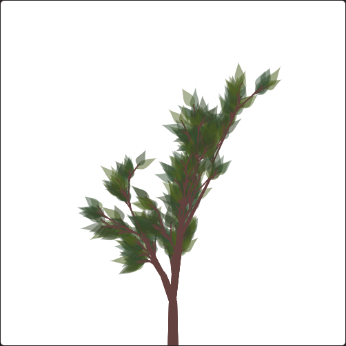
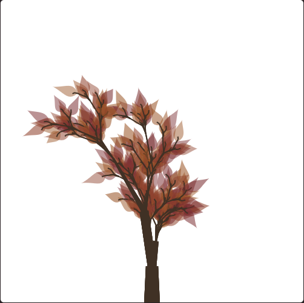
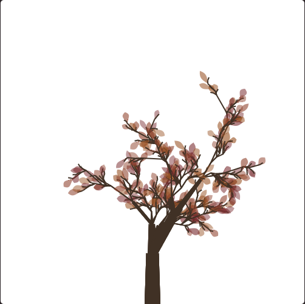
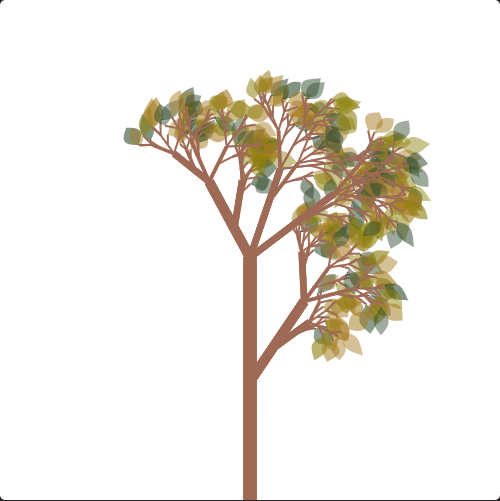
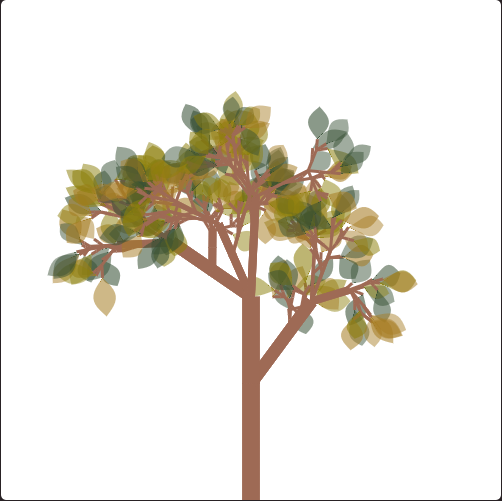
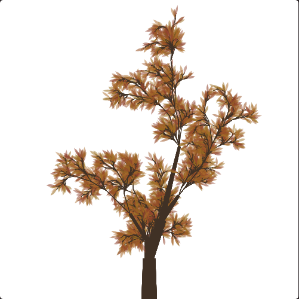
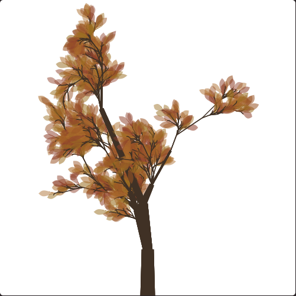
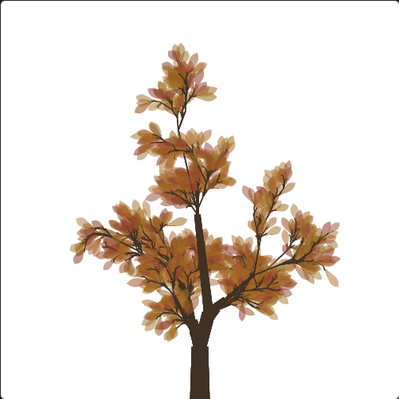

