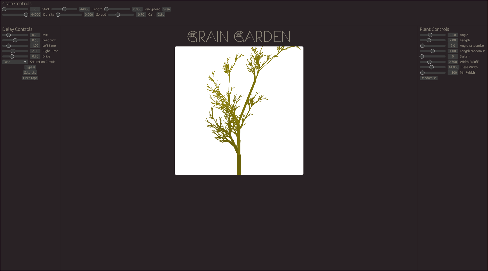

## Grain Garden
Grain Garden is a granular synthesizer controlled by a procedurally generated plant.
Built with Rust, Egui and Rodio.

## Screenshots
The Ui for Grain Garden currently looks like this.

### Some examples of procedural plants

    
Ferns

